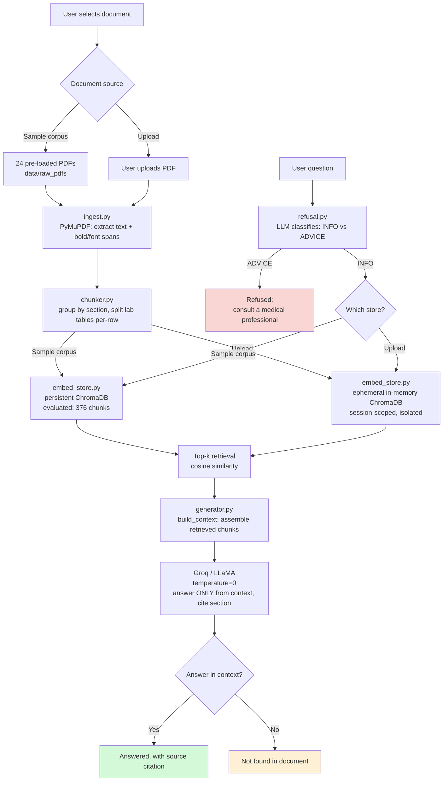

# 🩺 MediAssist

A retrieval-augmented generation (RAG) system that answers questions about a patient's own medical documents — grounded strictly in what the document actually says, with no medical advice and no invented facts.

## Problem

Discharge summaries and lab reports are full of clinical shorthand that patients and family members can't easily parse. Searching a general-purpose chatbot for answers is risky in this domain specifically: the AI will often answer confidently even when it's wrong, and there's no way to verify it. MediAssist is scoped narrowly to solve one thing well: let someone ask plain-language questions about *their own* uploaded medical document and get an answer that's either grounded in the document with a citation, or an honest refusal — never a guess dressed up as fact.

## What It Does / Does Not Do

**Does:** answers factual questions grounded strictly in the uploaded document (discharge summaries, lab reports, typed prescriptions — text-native PDFs only, no OCR/scanned documents).

**Does not:** diagnose, recommend treatment, advise on dosage, or speculate on prognosis.

## Features

- **Document Q&A** — ask questions about a selected medical PDF and get answers cited to the source section.
- **Refusal layer** — an LLM classification step detects advice-seeking questions and declines to answer rather than offering a medical recommendation.
- **Upload your own document** — process and query an arbitrary PDF at runtime, isolated in a session-scoped store, without affecting the evaluated baseline corpus.
- **Transparent grounding** — the UI shows the exact retrieved source chunks used to generate the answer, so it can be verified against the original text.
- **Measured accuracy** — evaluated end-to-end against a held-out question set, not just spot-checked.

## Architecture



## Tech Stack

- **PDF parsing**: PyMuPDF (`fitz`) — extracts text spans with font/bold metadata to detect section headers
- **Chunking**: custom logic — section-based for narrative text, per-row splitting for lab tables
- **Embeddings**: `sentence-transformers` (`all-MiniLM-L6-v2`)
- **Vector store**: ChromaDB (persistent for the evaluated corpus, in-memory for uploads)
- **Generation**: Groq API (`openai/gpt-oss-120b`), `temperature=0` for reproducible answers
- **UI**: Streamlit

## How It Works

1. A PDF is parsed into text spans, with bold spans (detected via both font name and the flags bitmask, to catch Word-export/EMR-style bolding) flagged as likely section headers.
2. Spans are grouped into sections; lab-result sections are split so each test/value pair becomes its own chunk. Column count for lab tables is detected dynamically from the header row rather than assumed fixed, and lines that aren't table-formatted at all (e.g. prescription-style "Test: Result" lines) fall back to one chunk per line.
3. Each chunk is embedded and stored in ChromaDB, tagged with source document and section.
4. On a question: a classification call checks INFO vs. ADVICE first. ADVICE questions are refused before any retrieval happens.
5. INFO questions retrieve the top-3 most relevant chunks by cosine similarity, scoped to the selected document.
6. Retrieved chunks are passed to the LLM with an instruction to answer only from that context and cite the source section, or say the information isn't present.

## Evaluation

Measured end-to-end against a 95-question held-out test set (`eval_qa.json`), using an LLM-as-judge for hallucination scoring (chosen over exact-string matching, since equally correct answers can cite different but valid source chunks).

| Metric | Result |
|---|---|
| Refusal accuracy | 100% (95/95) |
| Retrieval hit rate | 93.0% (66/71) |
| Hallucination rate | 5.6% (4/71) |

The improvement came from diagnosing a chunking bug: PyMuPDF merged an unusually long lab-test-name cell with its adjacent value into one span, misaligning every later row in that table. Fixed by detecting and splitting merged label/value pairs before chunking, then re-verified against the full eval set.

## Bugs Found & Fixed (Development History)

- **Bold detection was font-name-only** — missed PDFs that mark bold via a flags bitmask instead. Fixed by checking both signals.
- **Table column headers misclassified as section headers** — consecutive bold elements (e.g. "Test / Result / Range") were each tagged as a new section. Fixed by treating only the first bold element in a run as a real header.
- **Lab tables assumed a fixed 3-column layout** — rebuilt to detect column count dynamically from the header row.
- **Lab-section detection only matched exact "LAB RESULTS" text** — broadened to a keyword list covering common real-world naming variants.
- **Chunker assumed all lab data is tabular** — prescription documents have single-line "Test: Result (Range)" entries with no table header; added a fallback for this case.
- **Merged lab-value cells causing hallucinations** — see Evaluation above.
- **Non-deterministic generation** — Groq calls had no fixed `temperature`, occasionally causing the same question to get a different answer (including one observed case where the correct chunk was retrieved but the model still declined to answer). Fixed with `temperature=0`; re-ran the eval suite to confirm no regression.

## Known Limitations

**Scope of input documents**
- Handwritten prescriptions are explicitly out of scope — OCR misreads on handwriting risk producing a wrong dosage or drug name, undermining the system's core trust guarantee.
- Chunking logic is tuned to this project's synthetic dataset conventions. Verified failure case: an externally sourced lab report used a different bold-text pattern that caused nearly all content to be misclassified as table headers, and its table title ("Test Report") wasn't recognized as a lab section.
- Section-header detection assumes only the first element in a run of consecutive bold elements is a genuine header — two real section titles appearing back-to-back with no body text between them would be incorrectly merged. Not observed in testing, but not provably safe for an arbitrary document.
- Lab table formatting assumes Test/Result/Reference-Range semantics for its clean output even though column count is now dynamic — a 3-column table with different column meanings would still be formatted as if it were Test/Result/Range.
- Lab-section keyword matching is a known list, not fully general — would miss an unlisted section title with no matching keyword (e.g. "CHEM PANEL").

**Answer scope**
- Answers only what's explicitly stated in the selected document; does not define medical terminology that appears but isn't explained there (see Future Work).
- Single-document Q&A by design — matches the intended use case of understanding *one* document, not searching across many.

**Pipeline accuracy**
- Retrieval hit rate is 94.4%, hallucination rate is 8.5% — minimized and measured, not eliminated.
- LLM-as-judge evaluation is more robust than exact-match scoring but not infallible — manual review found a small number of judge false-positives and flawed ground-truth entries during development, both corrected.

**Uploaded documents**
- Embedded into a session-scoped, in-memory store, not persisted and not covered by the eval harness — the accuracy numbers above apply to the baseline corpus, not arbitrary uploads, which inherit the document-layout limitations above.

**Scale**
- Local ChromaDB persistence is sufficient at current scale. Beyond a few thousand documents, a managed vector store and async/batched embedding would be the natural next step — the retrieval logic itself wouldn't change.

## Future Work

- **Contextual term lookup** — for a term that appears in the document but isn't defined there, confirm its presence and supply a plain-language definition from general medical knowledge, clearly labeled as a different grounding tier from document-sourced answers.
- **Broader document layout support** — generalize chunking/section-detection beyond the synthetic dataset's conventions.
- **Scale** — managed vector store + batched embedding for larger corpora.

## Setup

```bash
git clone <your-repo-url>
cd MediAssist
pip install -r requirements.txt
```

Create a `.env` file in the project root:
```
GROQ_API_KEY=your_key_here
```

Run the app:
```bash
python -m streamlit run src/app.py
```

Run the evaluation harness:
```bash
python src/eval_harness.py
```

## Project Structure

```
MediAssist/
├── src/
│   ├── ingest.py          # PDF parsing (PyMuPDF)
│   ├── chunker.py         # Section/lab-table chunking
│   ├── embed_store.py     # Embedding + ChromaDB storage/retrieval
│   ├── generator.py       # Context building + LLM answer generation
│   ├── refusal.py         # Advice-seeking question classifier
│   ├── eval_harness.py    # End-to-end evaluation against eval_qa.json
│   └── app.py             # Streamlit UI
├── data/
│   ├── raw_pdfs/          # 24-document synthetic evaluation corpus
│   ├── eval_qa.json       # 95-question held-out test set
│   └── chroma_db/         # Persistent vector store (generated)
└── README.md
```

## Why didn't you use LangChain?

I wanted explicit control over the ingestion, chunking, retrieval and generation stages, so I implemented the pipeline directly. This also made it easier to debug retrieval failures and evaluate each stage independently


- **Eval harness silently went stale after a `generator.py` interface change** — 
  `answer_question()` was changed to return a structured dict (`{"type", "text", 
  "retrieved"}`) to support distinct UI states (answered/refused/not-found/error), 
  but `eval_harness.py` was not updated to match and continued treating the return 
  value as a plain string. This wouldn't crash outright — it would silently feed 
  malformed input to the judge LLM and produce a corrupted `eval_results.json`. 
  Caught by manually cross-checking that `eval_harness.py`'s assumptions still 
  matched `generator.py`'s actual behavior before trusting any reported metric. 
  Fixed by updating the harness to read `result["text"]`, and used the same pass 
  to correct two other measurement gaps: `check_retrieval_hit()` was checking for 
  the presence of a label word (e.g. "fasting glucose") rather than the actual 
  result value, and the hallucination judge had no way to distinguish a fabricated 
  answer from an honest "I don't have that information" — one prior "hallucination" 
  was actually a correct refusal. Corrected metrics: refusal accuracy 100% (95/95), 
  retrieval hit rate 93.0% (66/71), hallucination rate 5.6% (4/71).